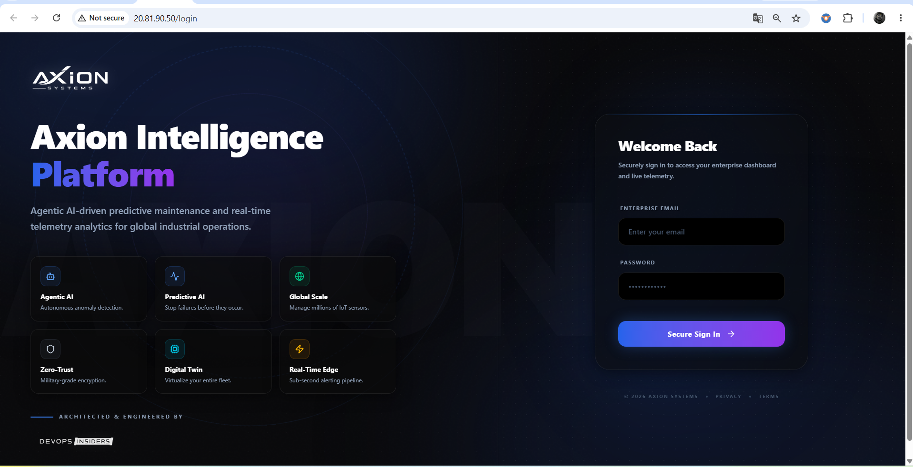
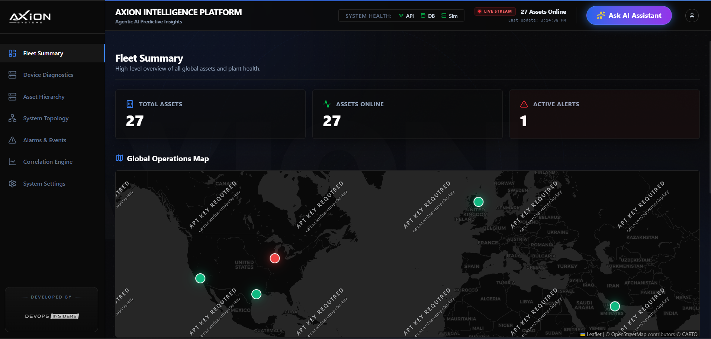
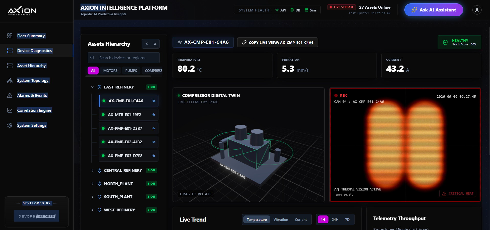
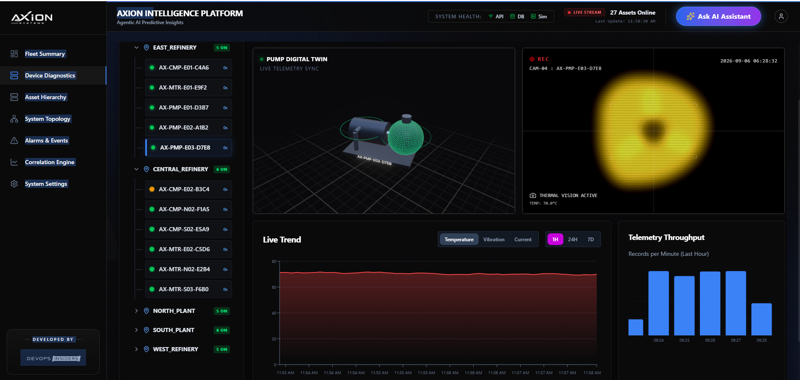
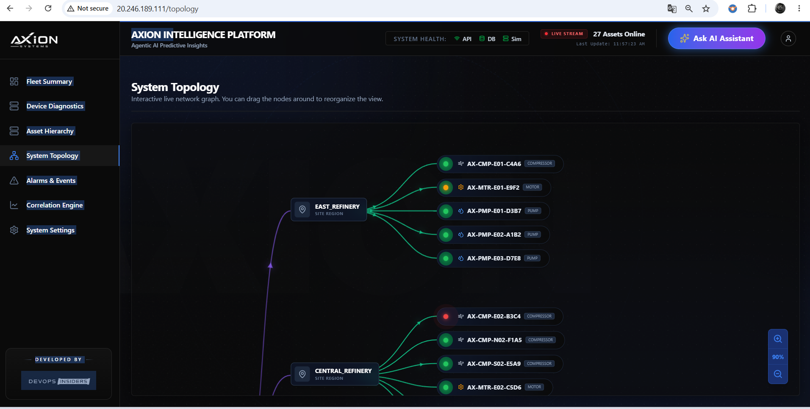
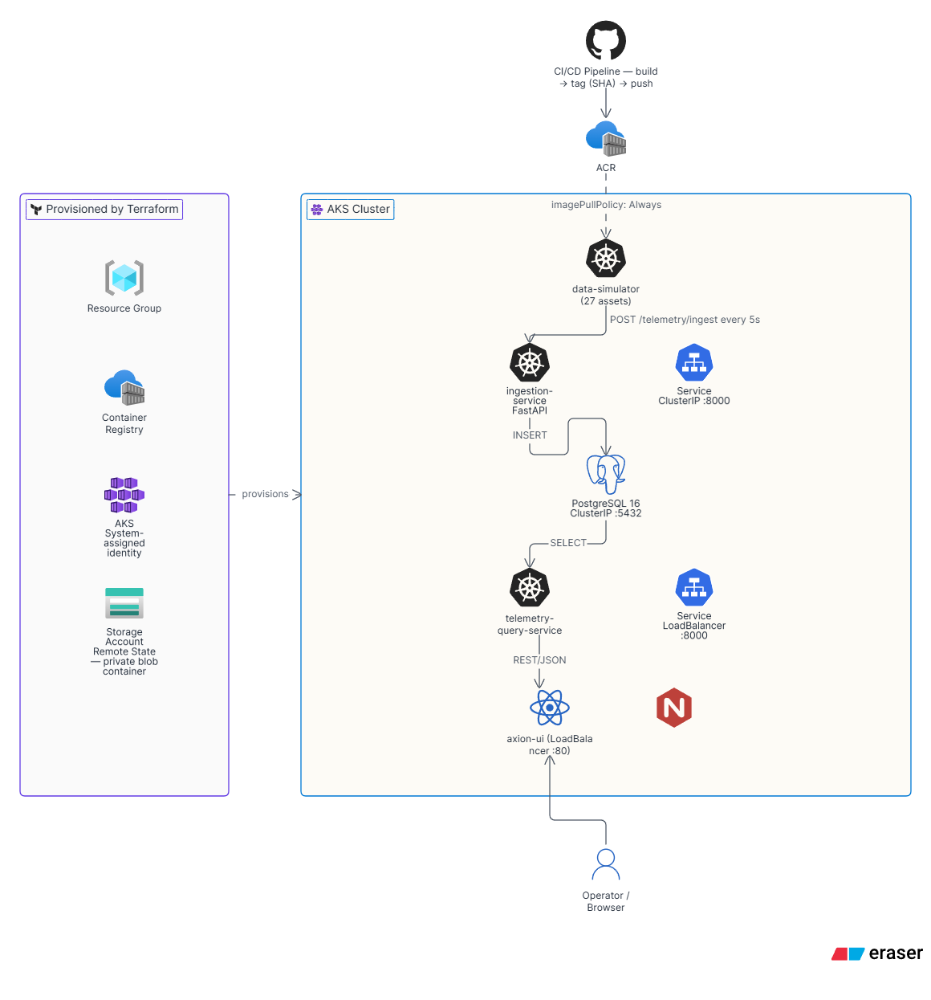

<div align="center">

# Axion Intelligence Platform

**A production-style industrial IoT telemetry platform — built, containerised and deployed end-to-end on Azure Kubernetes Service with Terraform and GitHub Actions.**

[](https://www.terraform.io/)
[](https://azure.microsoft.com/)
[](https://kubernetes.io/)
[](https://www.docker.com/)
[](https://github.com/features/actions)
[](https://fastapi.tiangolo.com/)
[](https://react.dev/)
[](https://www.postgresql.org/)

</div>

---

## Overview

Axion is a condition-monitoring platform for industrial equipment. **27 simulated assets** — pumps, motors and compressors spread across five refinery sites — stream temperature, vibration and current readings every five seconds. The platform ingests that stream, persists it, scores asset health in real time, and renders it in an operations dashboard with live trends, 3D digital twins and an interactive site topology.

The point of this repository is not the simulation — it is the **path from empty Azure subscription to a publicly reachable, running system**, with every layer expressed as code:

> Terraform provisions the Azure footprint → GitHub Actions builds and pushes images to ACR → Kubernetes manifests roll the workloads onto AKS → LoadBalancer services expose the UI and API.

Everything shown in the screenshots below is running on a live AKS cluster serving real ingested data.

---

## Live Proof

### Deployment walkthrough (video)

https://github.com/aniket-devop/axion-cloud-infrastructure/raw/main/docs/demo/axion-deployment-demo.mp4

> A full walkthrough of the application running on the AKS cluster. If the player does not load in your browser, [download or view it here](docs/demo/axion-deployment-demo.mp4).

### Authentication gateway

Served from the AKS `LoadBalancer` public IP.



### Fleet Summary — global operations view

KPI strip and geospatial map built from live aggregates: 27 assets online, one active critical alert, health state resolved per site region.



### Device Diagnostics — live telemetry and digital twin

Per-asset drill-down with a Three.js digital twin, thermal camera view and a health score computed server-side from temperature and vibration thresholds. The compressor below is running at 80.2 °C and flagged `CRITICAL HEAT`.



### Live trend and ingestion throughput

Time-series charts (1H / 24H / 7D) alongside a records-per-minute throughput histogram — direct evidence that the ingestion pipeline is writing continuously.



### System Topology — interactive asset graph

Force-directed graph of site regions and their child assets, colour-coded by live health state.



---

## Architecture



*Terraform provisions the Azure footprint; GitHub Actions builds and pushes container images to ACR; AKS pulls and runs the workloads; the simulator writes telemetry through the ingestion API into PostgreSQL, which the query service reads and serves to the React dashboard.*

**Design decisions worth calling out**

| Decision | Rationale |
|---|---|
| Write path and read path split into two services | Ingestion is write-heavy and latency-sensitive; the query service does aggregation and health scoring. Separating them lets each scale independently. |
| Terraform `for_each` over an `environments` map | One module tree renders dev / staging / prod without copy-pasted root configs. |
| Remote state in Azure Storage, bootstrapped separately | `state-infrastructure/` creates the backend before the main stack uses it — solving the chicken-and-egg problem cleanly instead of committing local state. |
| Images tagged by commit SHA **and** `latest` | SHA tags give immutable, traceable rollbacks; `latest` keeps the manifests simple for this demo. |
| Multi-stage Docker build for the UI | Node toolchain stays in the builder stage; the runtime image is Nginx + static assets only. |
| `admin_enabled = false` on ACR | Forces identity-based auth instead of shared admin credentials. |
| Health scoring in SQL/Python, not the browser | The dashboard stays a thin client; scoring logic is testable and consistent across consumers. |

---

## Repository layout

```
axion-cloud-infrastructure/
├── terraform/                      # Root stack: RG + ACR + AKS via reusable modules
│   ├── main.tf                     #   for_each over var.environments
│   ├── provider.tf                 #   azurerm ~> 4.0, remote azurerm backend
│   └── modules/
│       ├── resource-group/
│       ├── acr/
│       └── aks/
├── state-infrastructure/           # Bootstrap: storage account + private tfstate container
├── k8s/                            # Kubernetes manifests
│   ├── postgres.yaml               #   PostgreSQL 16 + ClusterIP
│   ├── ingestion.yaml              #   Ingestion API + ClusterIP
│   ├── query-service.yaml          #   Query API + LoadBalancer
│   ├── simulator.yaml              #   Telemetry generator
│   └── ui.yaml                     #   React dashboard + LoadBalancer
├── .github/workflows/
│   ├── infrastructure-deploy.yml   #   Terraform init → validate → plan
│   └── ingestion-build-push.yml    #   Path-filtered image build → ACR
├── axion-ingestion-service/        # FastAPI · asyncpg · Pydantic v2
├── axion-telemetry-query-service/  # FastAPI · aggregation + health scoring
├── axion-data-simulator/           # 27-asset random-walk generator w/ anomaly injection
├── axion-database-schema/          # DDL: pgcrypto, telemetry table, indexes
└── axion-ui/                       # React 19 · TypeScript · Tailwind 4 · Three.js · Recharts
```

---

## Technology stack

| Layer | Technology |
|---|---|
| **Infrastructure as Code** | Terraform 1.5+, `azurerm` provider ~> 4.0, remote state on Azure Blob Storage |
| **Cloud** | Azure — AKS, Azure Container Registry, Resource Groups, Storage Accounts |
| **Orchestration** | Kubernetes — Deployments, ClusterIP + LoadBalancer Services, env-based config |
| **CI/CD** | GitHub Actions, `azure/login@v2` (OIDC-ready service principal), Docker Buildx, GHA layer caching, `docker/metadata-action` |
| **Containers** | Docker — `python:3.12-slim` runtimes, multi-stage `node:20-alpine` → `nginx:alpine` for the UI |
| **Backend** | Python 3.12, FastAPI 0.115, asyncpg connection pooling, Pydantic v2 validation |
| **Database** | PostgreSQL 16, `pgcrypto` UUID keys, B-tree indexes on `device_id` and `timestamp DESC` |
| **Frontend** | React 19, TypeScript, Vite, Tailwind CSS 4, React Router 7, Recharts, Three.js / React Three Fiber, Leaflet |

---

## Data model

```sql
CREATE TABLE telemetry (
    id               UUID PRIMARY KEY DEFAULT gen_random_uuid(),
    device_id        VARCHAR(50)  NOT NULL,
    device_type      VARCHAR(20)  NOT NULL,   -- PUMP | MOTOR | COMPRESSOR
    refinery_region  VARCHAR(50)  NOT NULL,   -- NORTH_PLANT | SOUTH_PLANT | EAST/WEST/CENTRAL_REFINERY
    timestamp        TIMESTAMP    NOT NULL,
    temperature      DOUBLE PRECISION NOT NULL,   -- °C
    vibration        DOUBLE PRECISION NOT NULL,   -- mm/s
    current          DOUBLE PRECISION NOT NULL,   -- A
    created_at       TIMESTAMP DEFAULT CURRENT_TIMESTAMP
);

CREATE INDEX idx_telemetry_device_id  ON telemetry(device_id);
CREATE INDEX idx_telemetry_timestamp  ON telemetry(timestamp DESC);
```

`idx_telemetry_timestamp` is descending because every dashboard query is a "most recent N" read; the index is walked forwards rather than reverse-scanned.

**Health scoring** (applied in the query service):

| State | Condition |
|---|---|
| `critical` | temperature > 100 °C **or** vibration > 10 mm/s |
| `warning` | temperature > 85 °C **or** vibration > 6 mm/s |
| `healthy` | below both thresholds |

The score starts at 100 and is penalised 1 point per °C above 85 and 3 points per mm/s above 6, clamped to the range 10–100.

---

## API reference

### Ingestion service — `axion-ingestion-service`

| Method | Endpoint | Description |
|---|---|---|
| `GET` | `/health` | Liveness / readiness probe |
| `POST` | `/api/v1/telemetry/ingest` | Validate and persist one telemetry reading → `201` |
| `GET` | `/api/v1/telemetry?deviceId=&limit=` | Recent readings, newest first (`limit` 1–1000) |

```jsonc
// POST /api/v1/telemetry/ingest
{
  "deviceId": "AX-CMP-E01-C4A6",
  "deviceType": "COMPRESSOR",
  "refineryRegion": "EAST_REFINERY",
  "timestamp": "2026-09-06T06:27:45Z",
  "metrics": { "temperature": 80.2, "vibration": 5.3, "current": 43.2 }
}
```

### Query service — `axion-telemetry-query-service`

| Method | Endpoint | Description |
|---|---|---|
| `GET` | `/dashboard/summary` | Online asset count and last update timestamp |
| `GET` | `/dashboard/regions` | Per-region online / alert rollup |
| `GET` | `/dashboard/throughput` | Ingestion records per minute (last hour) |
| `GET` | `/devices` | All devices with their latest state and health score |
| `GET` | `/devices/{device_id}/latest` | Most recent reading for one asset |
| `GET` | `/devices/{device_id}/trends?hours=` | Historical series for charting |
| `GET` | `/devices/top-anomalous` | Assets ranked by anomaly severity |

Interactive OpenAPI docs are served by FastAPI at `/docs` on both services.

---

## Deployment

### Prerequisites

- Azure subscription and Azure CLI (`az`)
- Terraform ≥ 1.5.0
- `kubectl`
- Docker

### 1 — Bootstrap remote state

```bash
cd state-infrastructure
terraform init
terraform apply
```

Creates the storage account and the private `tfstate` container that the main stack's backend points at.

### 2 — Provision Azure infrastructure

```bash
cd ../terraform
terraform init
terraform validate
terraform plan  -var-file="environments.tfvars"
terraform apply -var-file="environments.tfvars"
```

<details>
<summary><b>Example <code>environments.tfvars</code></b></summary>

```hcl
azure_location = "eastus"

environments = {
  dev = {
    resource_group = { name = "rg-axion-dev" }

    acr = {
      name = "axionacrdev2026"
      sku  = "Standard"
    }

    aks = {
      name               = "aks-axion-dev"
      kubernetes_version = "1.30.0"
      node_count         = 2
      vm_size            = "Standard_D2s_v3"
    }
  }
}
```

Adding a `staging` or `prod` key to this map provisions a complete parallel environment — no changes to `main.tf` required.
</details>

### 3 — Connect kubectl and grant AKS pull access

```bash
az aks get-credentials --resource-group rg-axion-dev --name aks-axion-dev
az aks update --resource-group rg-axion-dev --name aks-axion-dev \
              --attach-acr $(terraform output -raw acr_name)
```

### 4 — Initialise the database schema

```bash
kubectl apply -f k8s/postgres.yaml
kubectl wait --for=condition=ready pod -l app=axion-db --timeout=120s

kubectl exec -i deploy/axion-db -- psql -U axion_user -d axion_db < axion-database-schema/01-extensions.sql
kubectl exec -i deploy/axion-db -- psql -U axion_user -d axion_db < axion-database-schema/02-telemetry.sql
```

### 5 — Roll out the application

```bash
kubectl apply -f k8s/ingestion.yaml
kubectl apply -f k8s/query-service.yaml
kubectl apply -f k8s/simulator.yaml
kubectl apply -f k8s/ui.yaml

kubectl get pods -w
kubectl get svc axion-ui axion-query-service   # public IPs appear here
```

---

## CI/CD pipelines

| Workflow | Trigger | What it does |
|---|---|---|
| `infrastructure-deploy.yml` | `workflow_dispatch` | Azure login → `terraform init` → `validate` → `plan`. Plan-only by design: infrastructure changes are reviewed before they are applied. |
| `ingestion-build-push.yml` | Push to `main` under `axion-ingestion-service/**`, or manual | Azure login → `az acr login` → Buildx build → push to ACR, tagged with the commit SHA and `latest`. |
| Per-service `docker-build-push.yml` | Push to `main` | Same build-and-push flow scoped to each service directory. |

Each pipeline uses `docker/metadata-action` for deterministic tagging and GitHub Actions cache (`type=gha, mode=max`) so unchanged layers are never rebuilt. Credentials are supplied entirely through repository secrets (`AZURE_CREDENTIALS`, `DOCKERHUB_TOKEN`) — nothing is committed.

The path filter on the ingestion workflow means a frontend commit does not trigger a backend rebuild, which keeps pipeline minutes proportional to what actually changed.

---

## Engineering highlights

- **Full IaC coverage.** Every Azure resource — including the Terraform state backend itself — is declared in code. There is no manually clicked resource anywhere in this stack.
- **Reusable, composable modules.** `resource-group`, `acr` and `aks` are standalone modules with explicit variables and outputs, wired together with `depends_on` so ordering is deterministic.
- **Multi-environment from one codebase.** The `environments` map means dev, staging and prod differ by data, not by duplicated Terraform.
- **Async Python throughout.** FastAPI with an `asyncpg` pool (min 2, max 10) managed through the lifespan context manager, so connections are opened once at startup and drained cleanly on shutdown.
- **Timezone-correct ingestion.** Incoming ISO-8601 timestamps are normalised to naive UTC before insert, preventing the offset drift that silently corrupts time-series comparisons.
- **Realistic simulation.** The generator uses a random walk that drifts 5 % toward a target per tick with added jitter, plus a scheduled anomaly manager that injects one critical and up to two warning faults lasting 1–5 minutes — so alerting and trend logic are exercised against believable signals, not step functions.
- **Container hygiene.** Dependency layers are copied and installed before application code, so a code change never invalidates the pip/npm cache layer.

---

## Roadmap

These are known gaps, listed deliberately — this is a portfolio build, and the shortcuts are intentional rather than accidental.

- [ ] **Move database credentials out of manifests** into Kubernetes `Secret` objects backed by Azure Key Vault (currently inline `env` values for demo reproducibility).
- [ ] **Replace `emptyDir` with a `PersistentVolumeClaim`** on Azure Disk so telemetry survives pod restarts.
- [ ] **Add readiness and liveness probes** plus resource requests/limits to every Deployment.
- [ ] **Replace dual LoadBalancers with a single Ingress** (NGINX Ingress + cert-manager) for TLS termination and path-based routing.
- [ ] **Externalise the frontend API base URL** to a runtime-injected environment variable instead of a build-time constant.
- [ ] **Extend the Terraform workflow to a gated `apply`** with a manual approval environment.
- [ ] **Tighten CORS** from `*` to the dashboard origin.
- [ ] **Add HorizontalPodAutoscalers** on the ingestion and query services.
- [ ] **Partition the telemetry table by time** and add a retention policy as volume grows.

---

## Author

**Aniket** — Cloud & DevOps Engineer

Built end-to-end: infrastructure, pipelines, backend services, database design and frontend.

[](https://github.com/aniket-devop)

---

<div align="center">
<sub>Architected & engineered as an independent portfolio project.</sub>
</div>
